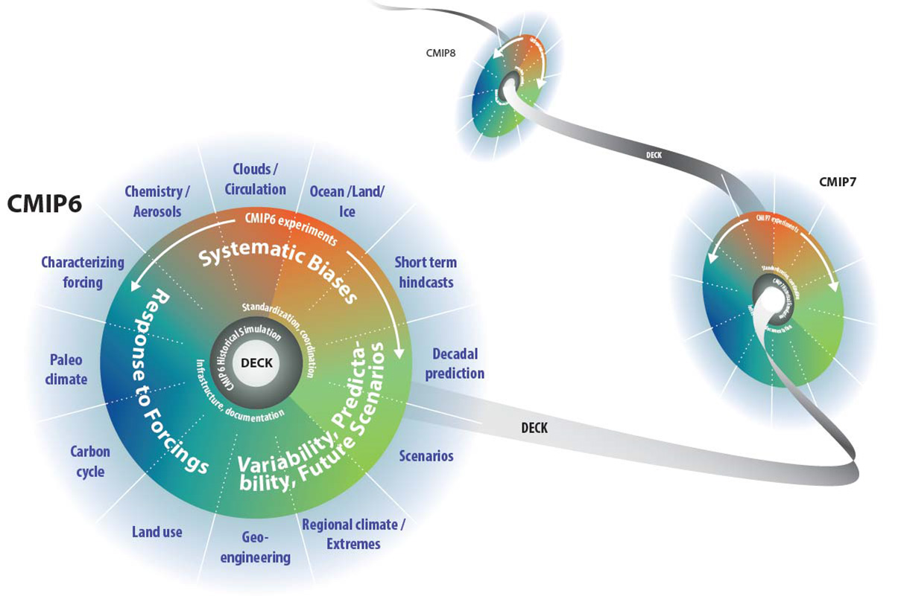
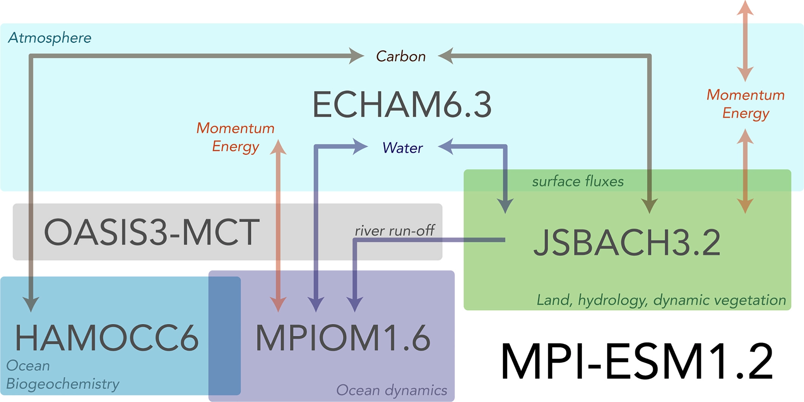
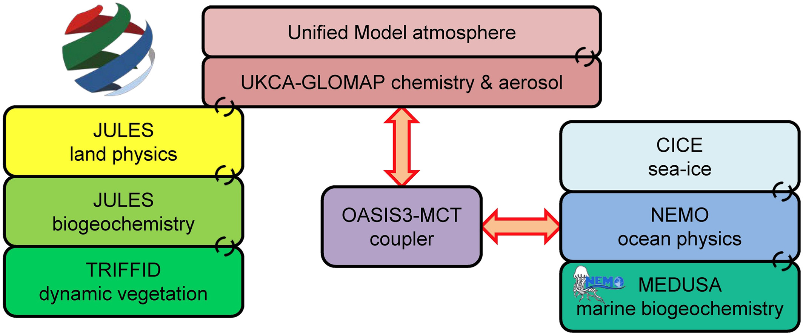

*  
*  

# CMIP6 - Coupled Model Intercomparison Project Phase 6

The Coupled Model Intercomparison Project (CMIP) organized under the auspices of the World Climate Research Programme’s (WCRP) Working Group on Coupled Modelling
(WGCM) started in 1995. The objective of CMIP is to better understand past, present, and future climate change arising from natural, unforced variability or in response to changes in radiative forcings in a multi-model context. An important part of CMIP is to make the multi-model output publicly available in a standardized format for analysis by the wider climate community and users. The standardization of the model output in a specified format, and the collection, archival, and access of the model output through the Earth System Grid Federation (ESGF) data replication centres have facilitated multi-model analyses. 
CMIP6 in its undergoing phase started in 2015. 

Website links
*   [WCRP-WGCM: A Short Introduction to Climate Models - CMIP & CMIP6](https://www.wcrp-climate.org/wgcm-cmip)
*   [CMIP6-Endorsed MIPs overview](https://www.wcrp-climate.org/modelling-wgcm-mip-catalogue/modelling-wgcm-cmip6-endorsed-mips)
*   [ESGF CMPI6 data search and download portal](https://esgf-node.llnl.gov/search/cmip6/)
*   [CMIP6 data request home page](http://clipc-services.ceda.ac.uk/dreq/index.html)
*   [CMIP6 data frenquency list](http://clipc-services.ceda.ac.uk/dreq/index/miptable.html)
*   [CMIP6 variables list](http://clipc-services.ceda.ac.uk/dreq/index/var.html)

Paper links
*   [CMIP6 overview paper: Eyring et al., 2016](https://gmd.copernicus.org/articles/9/1937/2016/gmd-9-1937-2016.html)
*   [CMIP6 scenario overview paper: O'Neill et al., 2016](https://gmd.copernicus.org/articles/9/3461/2016/gmd-9-3461-2016.pdf)
*   [CMIP6 data request overview paper](https://gmd.copernicus.org/articles/13/201/2020/)

# CMIP6 models:

# CESM

*  

The [Community Earth System Model](http://www.cesm.ucar.edu/) (CESM) is a fully-coupled, community, global climate model that provides state-of-the-art computer simulations of the Earth's past, present, and future climate states.

Some facts about CESM:

*   Written in Fortran 90
*   About 900 000 lines of Fortran 90 code
*   About 12,000 lines of scripts that configure, build, and run the model
*   Parallelized with [MPI](http://www.mpi-forum.org/) (Message Passing Interface) and [OpenMP](http://openmp.org/) (Open Multi-Processing)
*   To keep track of code changes, CESM developers currently use [git](https://en.wikipedia.org/wiki/Git). 
*   Fortran Coding standard as well as style rules are enforced and anyone wishing to contribute to the Community Atmosphere Model must comply to these [contributing guidelines](https://github.com/ESCOMP/CAM/wiki).

*   [CESM web page](http://www.cesm.ucar.edu/)
*   [CESM user's guide](https://escomp.github.io/CESM/release-cesm2/)
*   [CESM supported releases](https://csegweb.cgd.ucar.edu/experiments/public/)
*   [CESM scientifically validated configurations](http://www.cesm.ucar.edu/models/scientifically-supported.html)
*   [CESM bulletin board](http://bb.cgd.ucar.edu/)
*   [CESM support policy](http://www.cesm.ucar.edu/about/support.html)
*   [CESM discuss forum]{https://bb.cgd.ucar.edu/cesm/}
*   [Introduction on atmospheric configurations (compsets)]{https://ncar.github.io/CAM/doc/build/html/users_guide/atmospheric-configurations.html}
*   [CESM2 introduction paper: Danabasoglu et al., 2020](https://agupubs.onlinelibrary.wiley.com/doi/full/10.1029/2019MS001916)

## CESM2/CAM6

The 6th phase of the Community Atmosphere Model (CAM6) is the atmospheric component of the CESM2 used in CMIP6. The full description of the CAM6 can be found [here](https://ncar.github.io/CAM/doc/build/html/index.html).  

*   [CAM documentation](https://github.com/ESCOMP/CAM/wiki)
*   [CAM6 User's Guide](https://ncar.github.io/CAM/doc/build/html/users_guide/index.html)

* * *

## CESM2/WACCM6

The Whole Atmosphere Community Climate Model version 6 (WACCM6) is a major update of the whole atmosphere modeling capability in the Community Earth System Model 2 (CESM2), featuring enhanced physical, chemical and aerosol parameterizations. There are improvements in high-latitude climate variability at the surface and sea ice extent in WACCM6 over the lower top version of the model (CAM6) that comes from the extended vertical domain and expanded aerosol chemistry in WACCM6, highlighting the importance of the stratosphere and tropospheric chemistry for high-latitude climate variability.

*   [WACCM6 introduction paper: Gettelman et al 2019](https://agupubs.onlinelibrary.wiley.com/doi/full/10.1029/2019JD030943)

# NorESM

The [Norwegian Earth System Model](https://www.noresm.org/) (NorESM) has been developed since 2007 and has been an important tool for Norwegian climate researchers in the study of the past, present and future climate. The NorESM2 version is part of CMIP6 participating with two different resolutions called NorESM2 with medium (~1 deg) and low (~2 deg) resolution in the atmosphere respectively (called NorESM-MM/NorESM-LM in the ESGF data folder).  

The further development of NorESM will be supported by the [Infrastructure for Norwegian Earth System Modeling](https://www.ines.noresm.org/)(INES)  project.  

*   [NorESM Web page](https://www.noresm.org/)
*   [NorESM code access](https://github.com/NorESMhub/NorESM)
*   [NorESM-1 documentation](https://noresm-docs.readthedocs.io/en/noresm1/)
*   [NorESM-2 documentation](https://noresm-docs.readthedocs.io/en/noresm2/)
*   [NorESM2 introduction paper: Seland et al 2020](https://gmd.copernicus.org/articles/13/6165/2020/gmd-13-6165-2020.html)

# MPI-ESM

*  

The Max Planck Institute for Meteorology Earth System Model version 1.2 (MPI-ESM1.2) is the latest model version used in CMIP6, which consists of four model components and a coupler, which are connected as itwas done in the predecessor MPI-ESM (Figure 1, Giorgetta et al., 2013). The ocean dynamical model, MPIOM1.6, directly advects tracers of the ocean biogeochemistry model, HAMOCC6. The atmosphere model, ECHAM6.3, is directly coupled to the land model, JSBACH3.2, through surface exchange of mass, momentum, and heat. These two major model blocks are then coupled via the OASIS3-MCT coupler (Craiget al., 2017). MPI-ESM1.2 is part of CMIP6 participating with three different spatial and vertical resolutions in the atmosphere called high, low and coarse resolutions (named MPI-ESM-HR, -LR, -CR in the ESGF data folder). 

*   [MPI-ESM in CMIP5 introduction paper: Giorgetta et al., 2013](https://agupubs.onlinelibrary.wiley.com/doi/full/10.1002/jame.20038)
*   [MPI-ESM in CMIP6]{https://mpimet.mpg.de/en/science/projects/integrated-activities/cmip6}
*   [The Max Planck Institute for Meteorology Earth System Model special collections] (<add linkl>)
*   [MPI-ESM1.2 CMIP6 introduction paper: Mauritzen et al 2019](https://agupubs.onlinelibrary.wiley.com/doi/full/10.1029/2018MS001400)

# UKESM

*  

The UK Earth System Model (UKESM) is a new state-of-the-art ESM composed of components that represent both physical and bio-geochemical aspects of the Earth's atmosphere, ocean, cryosphere, and land systems. It is built on the recent Hadley Centre Global Environment Model Version 3 Global Coupled (GC) climate configuration, HadGEM3GC3.1 (Kuhlbrodt et al., 2018; Williams et al., 2017). 

*   [UKESM web page](https://ukesm.ac.uk/)
*   [UK models for CMIP6]{https://ukesm.ac.uk/cmip6/}
*   [The UK Earth System Models for CMIP6 special collections]{https://agupubs.onlinelibrary.wiley.com/doi/toc/10.1002/(ISSN)1942-2466.UKESM1}
*   [HadGEM3 GC3.1 introduction paper: Kuhlbrodt et al., 2018] (https://agupubs.onlinelibrary.wiley.com/doi/full/10.1029/2018MS001370)



