<!-- # Post-processing and Visualization -->
# Visualization

*   [Map visualization with python](#map-visualization-with-python)
*   [Customize your maps](#customize-your-plots)
	* [Set figure size](#set-figure-size)
	* [Plot 4D-fields such as Temperature](#plot-4d-fields-such-as-temperature)
	* [Change map projection](#change-map-projection)
*   [Georeferenced Latitude-Vertical plot](#georeferenced-latitude-vertical-plot)	
	* [2D plot for one longitude point](#2d-plot-for-one-longitude-point)
	* [2D plot over averaged longitudes](#2d-plot-over-averaged-longitudes)
*   [Adjust vertical axis](#Adjust-vertical-axis)

# Map visualization with xarray

Start a new **python 3** notebook on your JupyterHub and type the following commands.

On jupyter:

~~~
# Python package that makes working with labelled multi-dimensional arrays simple and efficient
import xarray as xr
import pandas as pd
~~~
{: .language-python}

This set of commands initialize the python 3 notebook with python package (*xarray*, *pandas*)
that we will use for plotting our netCDF model data.

Now we can create a map. We plot **tas** (near-surface (usually, 2 meter) air temperature) by specifying the filename, opening the dataset, decode the time and using the *xarray.DataArray.plot()* function:

Specify the path where CMIP6 model data is stored:

~~~
path = '~/shared-tacco-ns1004k-cmip/NCAR/CESM2-WACCM/historical/r1i1p1f1/Amon/tas/gn/v20190227/'
filename = path + 'tas_Amon_CESM2-WACCM_historical_r1i1p1f1_gn_185001-201412.nc'
print(filename)
~~~
{: .language-python}

~~~
~/shared-tacco-ns1004k-cmip/NCAR/CESM2-WACCM/historical/r1i1p1f1/Amon/tas/gn/v20190227/tas_Amon_CESM2-WACCM_historical_r1i1p1f1_gn_185001-201412.nc
~~~
{: .output}

Load netcdf file into an xarray dataset:

~~~
ds = xr.open_dataset(filename)
ds
~~~
{: .language-python}

~~~
<xarray.Dataset>
Dimensions:    (lat: 192, lon: 288, nbnd: 2, time: 1980)
Coordinates:
  * lat        (lat) float64 -90.0 -89.06 -88.12 -87.17 ... 88.12 89.06 90.0
  * lon        (lon) float64 0.0 1.25 2.5 3.75 5.0 ... 355.0 356.2 357.5 358.8
  * time       (time) object 1850-01-15 12:00:00 ... 2014-12-15 12:00:00
Dimensions without coordinates: nbnd
Data variables:
    tas        (time, lat, lon) float32 ...
    time_bnds  (time, nbnd) object ...
    lat_bnds   (lat, nbnd) float32 ...
    lon_bnds   (lon, nbnd) float32 ...
Attributes:
    Conventions:            CF-1.7 CMIP-6.2
    activity_id:            CMIP
    case_id:                4
    cesm_casename:          b.e21.BWHIST.f09_g17.CMIP6-historical-WACCM.001
    contact:                cesm_cmip6@ucar.edu
    creation_date:          2019-01-30T22:37:15Z
    data_specs_version:     01.00.29
    experiment:             all-forcing simulation of the recent past
    experiment_id:          historical
    external_variables:     areacella
    forcing_index:          1
    frequency:              mon
    further_info_url:       https://furtherinfo.es-doc.org/CMIP6.NCAR.CESM2-W...
    grid:                   native 0.9x1.25 finite volume grid (192x288 latxlon)
    grid_label:             gn
    initialization_index:   1
    institution:            National Center for Atmospheric Research, Climate...
    institution_id:         NCAR
    license:                CMIP6 model data produced by <The National Center...
    mip_era:                CMIP6
    model_doi_url:          https://doi.org/10.5065/D67H1H0V
    nominal_resolution:     100 km
    parent_activity_id:     CMIP
    parent_experiment_id:   piControl
    parent_mip_era:         CMIP6
    parent_source_id:       CESM2-WACCM
    parent_time_units:      days since 0001-01-01 00:00:00
    parent_variant_label:   r1i1p1f1
    physics_index:          1
    product:                model-output
    realization_index:      1
    realm:                  atmos
    source:                 CESM2 (2017): atmosphere: CAM6 (0.9x1.25 finite v...
    source_id:              CESM2-WACCM
    source_type:            AOGCM BGC CHEM AER
    sub_experiment:         none
    sub_experiment_id:      none
    table_id:               Amon
    tracking_id:            hdl:21.14100/55a8af4c-3729-4051-9e53-f22295c2ec1c
    variable_id:            tas
    variant_info:           CMIP6 CESM2 hindcast (1850-2014) with high-top at...
    variant_label:          r1i1p1f1
    branch_time_in_parent:  20075.0
    branch_time_in_child:   674885.0
    branch_method:          standard
~~~
{: .output}

<!-- 
By default, **time** has not been decoded properly:

~~~
* time       (time) float64 6.749e+05 6.749e+05 ... 7.351e+05 7.351e+05
~~~
{: .output}

It appears as a *float64* and is not recognized as a time but it is easy to correct it. Here is one 
way to do it afterwards:

~~~
timedata=pd.date_range(start=pd.to_datetime('1850-01-01'), end=pd.to_datetime('2014-12-31'), freq='M')
print(timedata)
~~~
{: .language-python}

~~~
DatetimeIndex(['1850-01-31', '1850-02-28', '1850-03-31', '1850-04-30',
               '1850-05-31', '1850-06-30', '1850-07-31', '1850-08-31',
               '1850-09-30', '1850-10-31',
               ...
               '2014-03-31', '2014-04-30', '2014-05-31', '2014-06-30',
               '2014-07-31', '2014-08-31', '2014-09-30', '2014-10-31',
               '2014-11-30', '2014-12-31'],
              dtype='datetime64[ns]', length=1980, freq='M')
~~~
{: .output}

Then we change the time index by this new timedata:

~~~ 
ds['time']=timedata
~~~
{: .language-python}
-->

Now we can plot the near-surface air temperature. We can use the isel() function to choose which timestep, i.e. year and month, to plot:

~~~
#To plot the first time step
ds.tas.isel(time=0).plot()
~~~

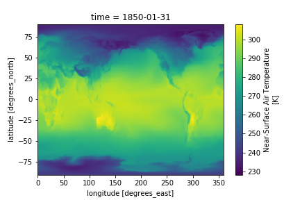

Alternatively, we can access the different timesteps by label using the sel() function, like so:

~~~
# To plot May 1929
ds.tas.sel(time='1929-05').plot()
~~~
{: .language-python}

# Customize your maps

##  Set figure size

To adjust the figure, we can use the matplotlib package.

~~~
#import python package
import matplotlib as mpl

#adjust figure size
mpl.rcParams['figure.figsize'] = [10., 8.]
ds.tas.isel(time=0).plot()
~~~ 
{: .language-python}

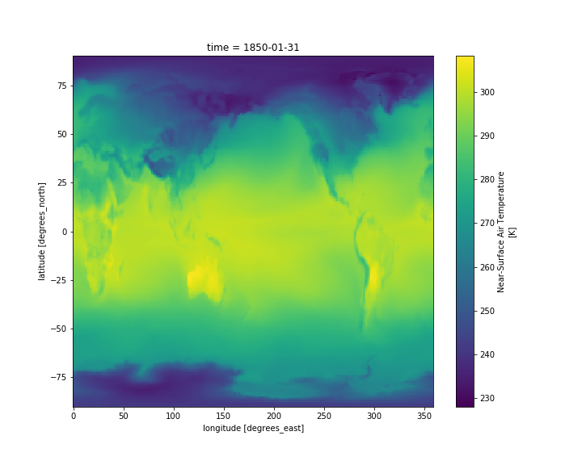

## Use a scientific color map

Using unscientific color maps like the rainbow (a.k.a. jet) color map distorts and hides the underlying data, while often making the figure unreadable to color-blind readers or when printed in black and white. 
Certain matplotlib colormaps, like the default "viridis" colormap in the plots above, avoid these problems.
If you want access to a suite of scientific colormaps (created by Fabio Crameri here at UiO), you can load the following function using this statment in your Jupyter Notebook:

~~~
%run shared-tacco-ns1004k/scripts/load_cmap.ipynb
~~~
{: .language-bash}
More info about scientific color maps, as well as a list of included color maps [here](http://www.fabiocrameri.ch/colourmaps.php)

This function can now be used as the color map argument when you plot:

~~~
ds.tas.isel(time=0).plot(cmap=load_cmap('batlow'))
~~~ 
{: .language-python}

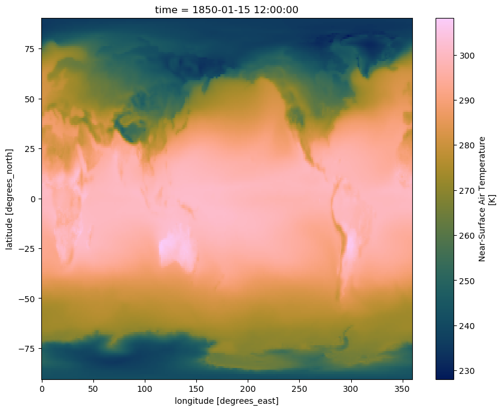

## Plot 4D-fields such as Temperature
		
Add another cell below the plot and display, in the same way, the temperature **ta** instead of the near-surface air temperature (tas). 

~~~
# Open data file and read data
path = '~/shared-tacco-ns1004k-cmip/NCAR/CESM2-WACCM/historical/r1i1p1f1/Amon/ta/gn/v20190227/'
filename = path + 'ta_Amon_CESM2-WACCM_historical_r1i1p1f1_gn_185001-201412.nc'
print(filename)
ds = xr.open_dataset(filename)

# Plot the first time step at the 850 hPa pressure level
ds.ta.isel(time=0, plev=2).plot(cmap=load_cmap('batlow'))
~~~
{: .language-python}

Contrary to **tas**, which depends only on two spatial dimensions (namely latitude and longitude) plus time, **ta** has an additional vertical dimension (plev).

> ## What did we plot?
>
> - What is the difference between tas and ta?
> - Which time did you plot?
> - Which level did you plot?
> - How to display the lowest model level?
{: .challenge}

Now, add another cell below the plot and try to display the zonal wind (ua) instead of the near-surface air temperature (tas).
Since ta and ua have an additional dimension (along the vertical), we also have to specify a vertical level
(between 0 and 18) to make our plot. 

On jupyter:

~~~
# Open data file and read data
path = '~/shared-tacco-ns1004k-cmip/NCAR/CESM2-WACCM/historical/r1i1p1f1/Amon/ua/gn/v20190227/'
filename = path + 'ua_Amon_CESM2-WACCM_historical_r1i1p1f1_gn_185001-201412.nc'
print(filename)
ds = xr.open_dataset(filename)

# Plot the first time step at higgest pressure level
ds.ua.isel(plev=-1,time=0).plot(cmap=load_cmap('broc'))
~~~
{: .language-python}

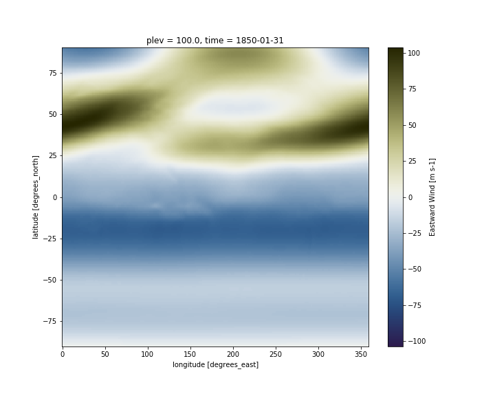

## Change map projection
We can use the Python package Cartopy to produce maps and do other geospatial data analyses.
We will also use pyplot, a collection of functions that make plotting simpler.

~~~
import cartopy.crs as ccrs
import matplotlib.pyplot as plt

fig = plt.figure()
ax = plt.axes(projection=ccrs.Miller())

ds.ua.isel(plev=-1,time=0).plot(ax=ax, 
           transform=ccrs.PlateCarree(),
           cmap=load_cmap('broc') 
          )

ax.coastlines()
~~~
{: .language-python}

#### Adding lat/lon labels when using projections

As you can see on the figure above, axes labels disappear when you change the map projection. You can add gridlines:

~~~
ax.gridlines()
~~~
{: .language-python}

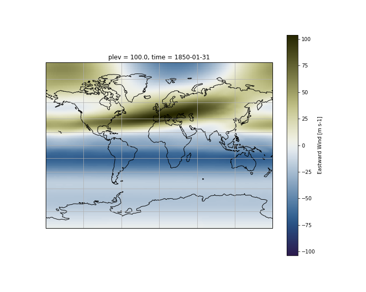

On recent version of cartopy (>= 0.18.0b1), [support for lat/lon labelling has been added for all projections](https://github.com/SciTools/cartopy/pull/1117).

On older versions of cartopy, **PlateCarree** and **Mercator** projections support lat/lon labelling:

~~~
fig = plt.figure(figsize=(15,10))
ax = plt.axes(projection=ccrs.Mercator())

ds.ua.isel(plev=-1,time=0).plot(ax=ax, 
           transform=ccrs.PlateCarree(),
           cmap=load_cmap('broc') 
          )

ax.coastlines()

# Add gridlines with labels
gl = ax.gridlines(color='lightgrey', linestyle='-', draw_labels=True)

# Do not draw labels on the top and right of the map.
gl.xlabels_top = False
gl.ylabels_right = False
~~~
{: .language-python}

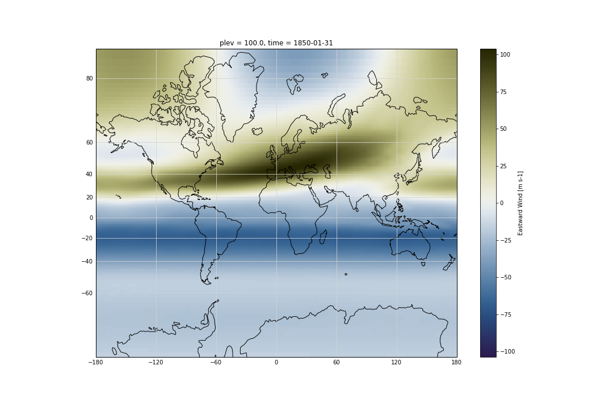

The list of available cartopy projections is available [here](https://scitools.org.uk/cartopy/docs/latest/crs/projections.html).

> ## Plotting your model outputs
> - Use data from CMIP6 model data to generate maps for various variables such as ta, ua and any other variables that may be of interest for your analysis.
> **Tips**: To read your model outputs, use: 
>
> ~~~
> path = '#YOUR-DATA-PATH' 
> filename = path + '#YOUR-DATA-FILE-NAME' 
> ~~~
> {: .language-python}
>
{: .challenge}

## Georeferenced Latitude-Vertical plot 

### 2D plot for one longitude point

We use *xarray*'s *sel* to select the data along longitude 0 at time 1850-01-31.

~~~
ds.ua.sel(lon=0,time="1850-01-31").plot(cmap=load_cmap('broc'))
~~~
{: .language-python}

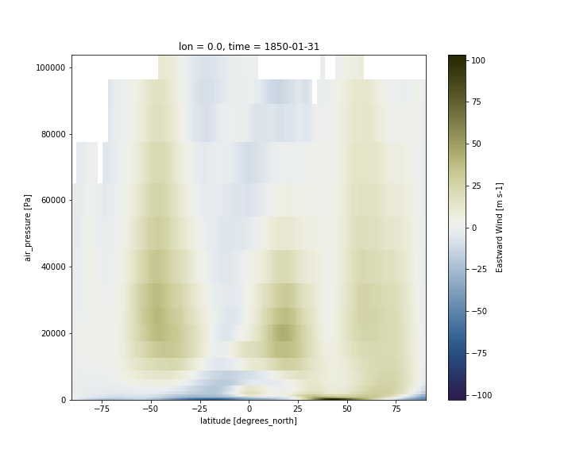

### 2D plot over averaged longitudes
Now instead of selecting one longitude, we average over all the longitudes,
using the *mean* function:

~~~
ds.ua.sel(time="1850-01-31").mean(dim='lon').plot(cmap=load_cmap('broc'))
~~~
{: .language-python}

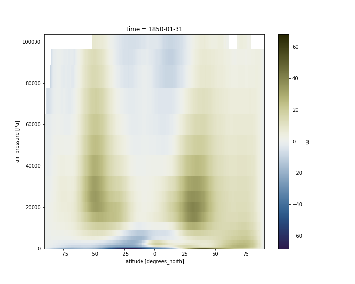

### Adjust vertical axis

Having pressure values as the vertical coordinate, it is clear that we need to revert the vertical axis to get the lower values at the top and the highest values at the bottom:

~~~
ds.ua.sel(time="1850-01-31").mean(dim='lon').plot(cmap=load_cmap('broc'))
plt.ylim(plt.ylim()[::-1])
~~~
{: .language-python}

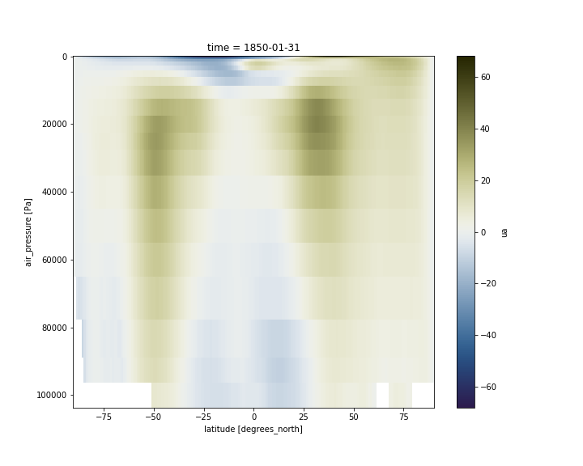

For pressure levels, we usually use hPa instead of Pa. 

~~~
#Change pressure level from Pa to hPa
hpa=ds.ua.plev/100
ds['plev']=hpa
ds.ua.plev.attrs['units'] = 'hPa'
ds.ua.plev.attrs['standard_name'] = 'air_pressure'
ds.ua.plev

#plot
ds.ua.sel(time="1850-01-31").mean(dim='lon').plot(cmap=load_cmap('broc'))
plt.ylim(plt.ylim()[::-1])
~~~
{: .language-python}

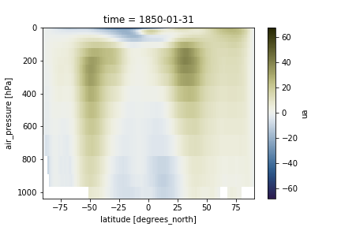

We can also adjust the top of the figure. 
When the vertical axis is pressure levels, we can use a log scale to plot it so as to make it more intuitive to look at.

~~~
ds.ua.sel(time="1850-01-31").mean(dim='lon').plot(cmap=load_cmap('broc'))
plt.ylim(plt.ylim()[::-1])
plt.ylim(top=0.001)
plt.yscale('log')
~~~
{: .language-python}

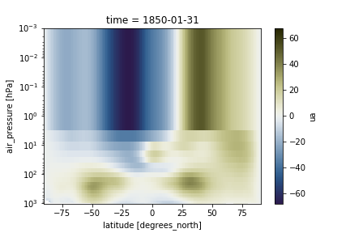

> ## Georeferenced Latitude-Vertical plot with CMIP6 model data
> - Use data from the model you choose to generate georeferenced Latitude-Vertical plot for U and T. 
>
> **Tips**: To read your model outputs, use: 
>
> ~~~
> path = '#YOUR-MODEL-DATA-PATH' 
> filename = path + '#YOUR-MODEL-DATA-FILE' 
> ~~~
> {: .language-python}
>
{: .challenge}



