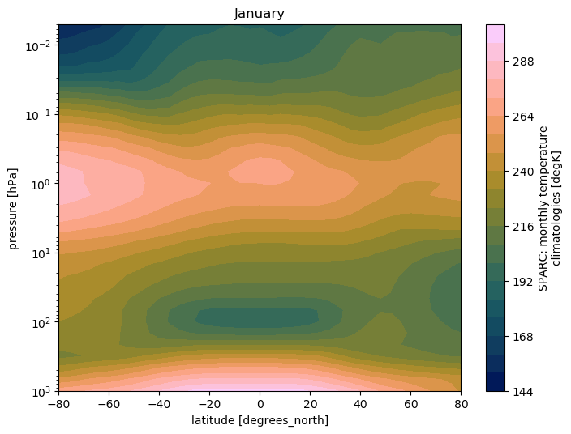
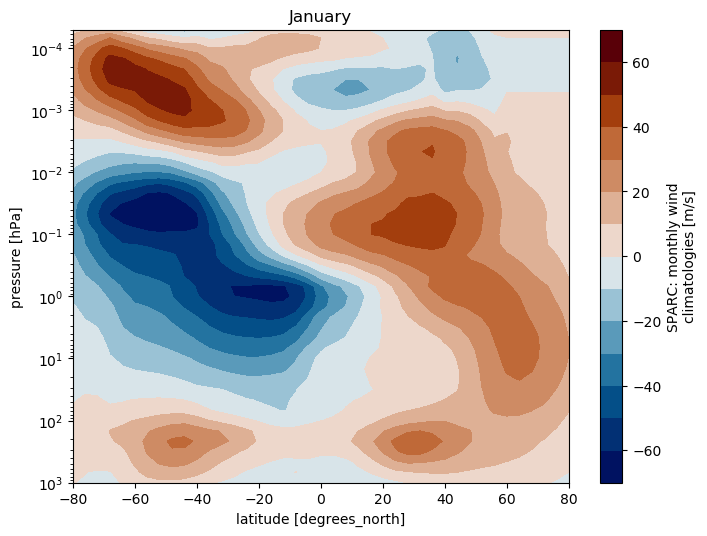
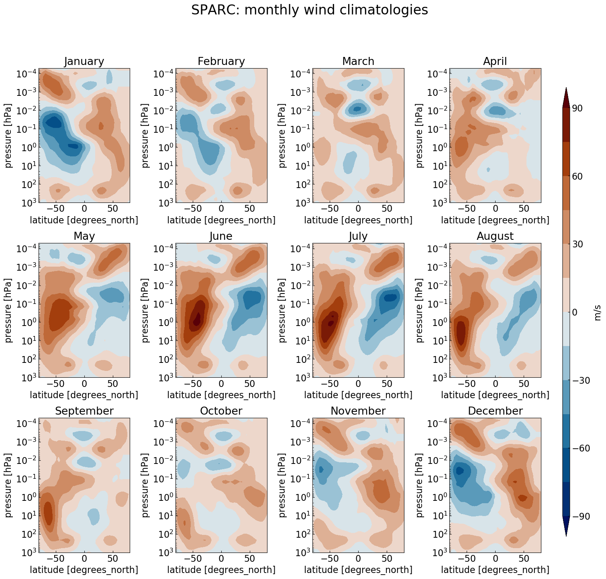

*   [What is a climatology?](#what-is-a-climatology)
	*   [SPARC Climatology](#sparc-climatology)
*   [Compare CMIP6 model data to the SPARC climatology](#compare-the-control-run-to-the-sparc-climatology)
	*   [Methodology](#methodology)
	*   [Exercice](#exercice) ([check the deadline!](#deadline))

# What is a climatology?

A Climatology is a climate data series.

In this lesson, we will use climatological data issued from the [Stratosphere-troposphere Processes And their Role in Climate](https://www.sparc-climate.org/) project (SPARC) and in particular the [Temperature and Zonal Wind Climatology](https://www.sparc-climate.org/data-centre/data-access/reference-climatology/randals-climatologies/temperature-wind-climatology/).

## SPARC Climatology

These data sets provide an updated climatology of zonal mean temperatures and winds covering altitudes 0-85 km. They are based on combining data from a variety of sources, and represent the time period 1992-1997 (SPARC Report No. 3, Randel et al 2002).
https://www.sparc-climate.org/wp-content/uploads/sites/5/2017/12/SPARC_Report_No3_Dec2002_Climatologies.pdf

The zonal mean temperature climatology is derived using UK Met Office (METO) analyses over 1000-1.5 hPa, combined with Halogen Occultation Experiment (HALOE) temperature climatology over pressures 1.5-0.0046 hPa (~85 km).

The monthly zonal wind climatology is derived from the UARS Reference Atmosphere Project (URAP), combining results from METO analyses with winds the UARS High Resolution Doppler Imager (HRDI). Details from the URAP winds are described in Swinbank and Ortland (2003).

[NCAR's Climate Data Guide](https://climatedataguide.ucar.edu/) (CDG) provides more information (search SPARC) including strengths and weaknesses of assorted data sets.

## Plotting SPARC climatology

The SPARC climatology **T** and **U** is stored in a file called **sparc.nc** and can be found on the Jupyterhub.

In the Jupyterhub Terminal:

~~~
cd $HOME/shared-tacco-ns1004k/SPARC
ls
~~~
{: .language-bash}

~~~
sparc.nc
~~~
{: .output}

> ## Exercise
> 
> What are the horizontal and vertical resolution of the SPARC data?
> What variables included in the SPARC dataset?
> 
> To answer this question:
> - You can use ncdump or CDO 
>
{: .challenge}

## Plotting SPARC climatology using *python*

### Open SPARC climatology netCDF file

~~~
import xarray as xr
import matplotlib as mpl
import matplotlib.pyplot as plt
import numpy as np
import calendar

mpl.rcParams['figure.figsize'] = [8., 6.]

filename = 'shared-tacco-ns1004k/SPARC/sparc.nc'
ds = xr.open_dataset(filename)
ds
~~~
{: .language-python}

~~~
<xarray.Dataset>
Dimensions:   (lat: 41, lev_temp: 33, lev_wind: 46, month: 12)
Coordinates:
  * lev_wind  (lev_wind) float32 1000.0 681.29193 ... 3.1622778e-05
  * lat       (lat) float32 -80.0 -76.0 -72.0 -68.0 ... 68.0 72.0 76.0 80.0
  * month     (month) int32 1 2 3 4 5 6 7 8 9 10 11 12
  * lev_temp  (lev_temp) float32 1000.0 681.29193 ... 0.006812923 0.004641587
Data variables:
    WIND      (lev_wind, lat, month) float32 ...
    TEMP      (lev_temp, lat, month) float32 ...
Attributes:
    creation_date:  Tue Feb 21 09:23:03 CET 2017
    creator:        D. Shea, NCAR
    Conventions:    None
    referencese:    \nRandel, W.J. et al., (2004)                            ...
    WWW_data:       http://www.sparc-climate.org/data-center/data-access/refe...
    WWW:            http://www.sparc-climate.org/
    README:         ftp://sparc-ftp1.ceda.ac.uk/sparc/ref_clim/randel/temp_wi...
    title:          SPARC Intercomparison of Middle Atmosphere Climatologies
~~~
{: .output}

### SPARC climatology: Plot Temperature 

~~~
#import color maps
%run shared-tacco-ns1004k/scripts/load_cmap.ipynb

# plot for January (month=0)
ds.TEMP.isel(month=0).plot.contourf(cmap=load_cmap('batlow'),
                                   levels=20)

plt.title(calendar.month_name[1])
plt.ylim(plt.ylim()[::-1])
plt.yscale('log')
plt.ylim(top=0.005)
plt.ylim(bottom=1000.)
plt.xlim(left=ds.TEMP.lat.min())
plt.xlim(right=ds.TEMP.lat.max())
~~~
{: .language-python}

### SPARC climatology: Plot zonal wind

~~~
ds.WIND.isel(month=0).plot.contourf(cmap=load_cmap('vik'),
                                   levels=15)

plt.title(calendar.month_name[1])
plt.ylim(plt.ylim()[::-1])
plt.yscale('log')
plt.ylim(top=5.0e-5)
plt.ylim(bottom=1000.)
plt.xlim(left=ds.TEMP.lat.min())
plt.xlim(right=ds.TEMP.lat.max())
~~~
{: .language-python}

### Multiple plots 

To generate 12 subplots (one per month) for the zonal wind and temperature climatology, we can use the Python **range(start, stop[, step])** function (remember that the range of integers ends at **stop - 1**):

~~~
import xarray as xr
import matplotlib as mpl
import matplotlib.pyplot as plt
import numpy as np
import calendar

fig = plt.figure(figsize=[18,16])
for month in range(1,13):
    ax = fig.add_subplot(3, 4, month)  # specify number of rows and columns, and axis
    
    ax.set_title(label = calendar.month_name[month])

fig.suptitle(ds.WIND.attrs['long_name'], fontsize=22)
    
# Add shared colorbar:
fig.subplots_adjust(right=0.82, wspace=0.5, hspace=0.3) # adjust subplots so we keep a bit of space on the right for the colorbar    
cbar_ax = fig.add_axes([0.85, 0.15, 0.01, 0.7]) # Specify where to place the colorbar
#fig.colorbar(<handle of your contour plot here>, cax=cbar_ax, label=ds.WIND.attrs['units']) # Add a colorbar to the figure

~~~
{: .language-python}

This allows you to plot, e.g., the zonal wind like this:

> ## Make a multiple plot for the SPARC temperature
>
> Make the same kind of multiple plot but for the temperature instead. 
>
<!--
> > ## Solution
> > 
> > ~~~
> >import xarray as xr
> >import matplotlib as mpl
> >import matplotlib.pyplot as plt
> >import numpy as np
> >import calendar
> >
> >
> >filename = 'shared-tacco-ns1004k/SPARC/sparc.nc'
> >ds = xr.open_dataset(filename)
> >
> >fig = plt.figure(figsize=[25, 18])
> >for month in range(1,13):
> >    ax = fig.add_subplot(3, 4, month)  # specify (nrows, ncols, axnum)
> >
> >    levels=np.arange(140,320,10)
> >
> >    cs=ds.TEMP.isel(month=month-1).plot.contourf(ax=ax,
> >                                                 extend='both',
> >                                                 cmap=load_cmap('vik'), 
> >                                                 vmin=140, 
> >                                                 vmax = 310, 
> >                                                 add_colorbar=False, 
> >                                                 levels= levels)
> >
> >    plt.ylim(plt.ylim()[::-1])
> >    plt.yscale('log')
> >    ax.set_title(label = calendar.month_name[month])
> >    ax.set_ylim(top=0.005)
> >    ax.set_ylim(bottom=1000.)
> >    ax.set_xlim(left=ds.TEMP.lat.min())
> >    ax.set_xlim(right=ds.TEMP.lat.max())
> >    
> >fig.suptitle(ds.TEMP.attrs['long_name'], fontsize=24)
> >    
> ># adjust subplots so we keep a bit of space on the right for the colorbar    
> >fig.subplots_adjust(right=0.8, wspace=0.3, hspace=0.5)
> ># Specify where to place the colorbar
> >cbar_ax = fig.add_axes([0.85, 0.15, 0.02, 0.7])
> ># Add a unique colorbar to the figure
> >fig.colorbar(cs, cax=cbar_ax, label=ds.TEMP.attrs['units'])
> >
> > ~~~
> > {: .language-python}
> >
> > 
> > 
> {: .solution}
-->
>
{: .challenge}

# Home-assignment: Visualize and compare CMIP6 model data to the SPARC climatology

Now that we are familiar with the SPARC climatology, we are ready to analyze CMIP6 model data and make comparison with it. This is the goal of the first exercise you will have to fulfill. 

To help you we summarize the [methodology](#methodology) you can follow (please note that there is not one unique way to analyze and plot, and you should feel free to divert from the methodology given)
<!--- we give you some [instructions](#exercise) with a list of questions you need to answer-->

## Methodology

### Which variables to analyze and why?

You can analyze many variables from the control run to check its validity but at least **T** (temperature) and **U** (zonal wind) as
these two variables are the one contained in the SPARC climatology. 

<!--

### How to compute yearly means from the CMIP6 monthly data?

In python, the [xarray](http://xarray.pydata.org/en/stable/) package is very handy as it can also open several
files and compute yearly average. Here is an example, where we first create a list (called *files*) with all
the filenames we wish to analyze:

~~~
import xarray as xr
import pandas as pd
import glob
import os

files =  glob.glob(os.path.join('shared-tacco-ns1004k-cmip/MPI-M/MPI-ESM1-2-HR/historical/r1i1p1f1/Amon/ua/gn/v20190710/', 'ua_Amon_MPI-ESM1-2-HR_historical_r1i1p1f1_gn_*'))
# sort files so they appear by year/month
files.sort()
files
~~~
{: .language-python}

~~~
['shared-tacco-ns1004k-cmip/MPI-M/MPI-ESM1-2-HR/historical/r1i1p1f1/Amon/ua/gn/v20190710/ua_Amon_MPI-ESM1-2-HR_historical_r1i1p1f1_gn_185001-185412.nc',
 'shared-tacco-ns1004k-cmip/MPI-M/MPI-ESM1-2-HR/historical/r1i1p1f1/Amon/ua/gn/v20190710/ua_Amon_MPI-ESM1-2-HR_historical_r1i1p1f1_gn_185501-185912.nc',
 'shared-tacco-ns1004k-cmip/MPI-M/MPI-ESM1-2-HR/historical/r1i1p1f1/Amon/ua/gn/v20190710/ua_Amon_MPI-ESM1-2-HR_historical_r1i1p1f1_gn_186001-186412.nc',
 'shared-tacco-ns1004k-cmip/MPI-M/MPI-ESM1-2-HR/historical/r1i1p1f1/Amon/ua/gn/v20190710/ua_Amon_MPI-ESM1-2-HR_historical_r1i1p1f1_gn_186501-186912.nc',
 'shared-tacco-ns1004k-cmip/MPI-M/MPI-ESM1-2-HR/historical/r1i1p1f1/Amon/ua/gn/v20190710/ua_Amon_MPI-ESM1-2-HR_historical_r1i1p1f1_gn_187001-187412.nc',
 'shared-tacco-ns1004k-cmip/MPI-M/MPI-ESM1-2-HR/historical/r1i1p1f1/Amon/ua/gn/v20190710/ua_Amon_MPI-ESM1-2-HR_historical_r1i1p1f1_gn_187501-187912.nc',
 'shared-tacco-ns1004k-cmip/MPI-M/MPI-ESM1-2-HR/historical/r1i1p1f1/Amon/ua/gn/v20190710/ua_Amon_MPI-ESM1-2-HR_historical_r1i1p1f1_gn_188001-188412.nc',
 'shared-tacco-ns1004k-cmip/MPI-M/MPI-ESM1-2-HR/historical/r1i1p1f1/Amon/ua/gn/v20190710/ua_Amon_MPI-ESM1-2-HR_historical_r1i1p1f1_gn_188501-188912.nc',
 'shared-tacco-ns1004k-cmip/MPI-M/MPI-ESM1-2-HR/historical/r1i1p1f1/Amon/ua/gn/v20190710/ua_Amon_MPI-ESM1-2-HR_historical_r1i1p1f1_gn_189001-189412.nc',
 'shared-tacco-ns1004k-cmip/MPI-M/MPI-ESM1-2-HR/historical/r1i1p1f1/Amon/ua/gn/v20190710/ua_Amon_MPI-ESM1-2-HR_historical_r1i1p1f1_gn_189501-189912.nc',
 'shared-tacco-ns1004k-cmip/MPI-M/MPI-ESM1-2-HR/historical/r1i1p1f1/Amon/ua/gn/v20190710/ua_Amon_MPI-ESM1-2-HR_historical_r1i1p1f1_gn_190001-190412.nc',
 'shared-tacco-ns1004k-cmip/MPI-M/MPI-ESM1-2-HR/historical/r1i1p1f1/Amon/ua/gn/v20190710/ua_Amon_MPI-ESM1-2-HR_historical_r1i1p1f1_gn_190501-190912.nc',
 'shared-tacco-ns1004k-cmip/MPI-M/MPI-ESM1-2-HR/historical/r1i1p1f1/Amon/ua/gn/v20190710/ua_Amon_MPI-ESM1-2-HR_historical_r1i1p1f1_gn_191001-191412.nc',
 'shared-tacco-ns1004k-cmip/MPI-M/MPI-ESM1-2-HR/historical/r1i1p1f1/Amon/ua/gn/v20190710/ua_Amon_MPI-ESM1-2-HR_historical_r1i1p1f1_gn_191501-191912.nc',
 'shared-tacco-ns1004k-cmip/MPI-M/MPI-ESM1-2-HR/historical/r1i1p1f1/Amon/ua/gn/v20190710/ua_Amon_MPI-ESM1-2-HR_historical_r1i1p1f1_gn_192001-192412.nc',
 'shared-tacco-ns1004k-cmip/MPI-M/MPI-ESM1-2-HR/historical/r1i1p1f1/Amon/ua/gn/v20190710/ua_Amon_MPI-ESM1-2-HR_historical_r1i1p1f1_gn_192501-192912.nc',
 'shared-tacco-ns1004k-cmip/MPI-M/MPI-ESM1-2-HR/historical/r1i1p1f1/Amon/ua/gn/v20190710/ua_Amon_MPI-ESM1-2-HR_historical_r1i1p1f1_gn_193001-193412.nc',
 'shared-tacco-ns1004k-cmip/MPI-M/MPI-ESM1-2-HR/historical/r1i1p1f1/Amon/ua/gn/v20190710/ua_Amon_MPI-ESM1-2-HR_historical_r1i1p1f1_gn_193501-193912.nc',
 'shared-tacco-ns1004k-cmip/MPI-M/MPI-ESM1-2-HR/historical/r1i1p1f1/Amon/ua/gn/v20190710/ua_Amon_MPI-ESM1-2-HR_historical_r1i1p1f1_gn_194001-194412.nc',
 'shared-tacco-ns1004k-cmip/MPI-M/MPI-ESM1-2-HR/historical/r1i1p1f1/Amon/ua/gn/v20190710/ua_Amon_MPI-ESM1-2-HR_historical_r1i1p1f1_gn_194501-194912.nc',
 'shared-tacco-ns1004k-cmip/MPI-M/MPI-ESM1-2-HR/historical/r1i1p1f1/Amon/ua/gn/v20190710/ua_Amon_MPI-ESM1-2-HR_historical_r1i1p1f1_gn_195001-195412.nc',
 'shared-tacco-ns1004k-cmip/MPI-M/MPI-ESM1-2-HR/historical/r1i1p1f1/Amon/ua/gn/v20190710/ua_Amon_MPI-ESM1-2-HR_historical_r1i1p1f1_gn_195501-195912.nc',
 'shared-tacco-ns1004k-cmip/MPI-M/MPI-ESM1-2-HR/historical/r1i1p1f1/Amon/ua/gn/v20190710/ua_Amon_MPI-ESM1-2-HR_historical_r1i1p1f1_gn_196001-196412.nc',
 'shared-tacco-ns1004k-cmip/MPI-M/MPI-ESM1-2-HR/historical/r1i1p1f1/Amon/ua/gn/v20190710/ua_Amon_MPI-ESM1-2-HR_historical_r1i1p1f1_gn_196501-196912.nc',
 'shared-tacco-ns1004k-cmip/MPI-M/MPI-ESM1-2-HR/historical/r1i1p1f1/Amon/ua/gn/v20190710/ua_Amon_MPI-ESM1-2-HR_historical_r1i1p1f1_gn_197001-197412.nc',
 'shared-tacco-ns1004k-cmip/MPI-M/MPI-ESM1-2-HR/historical/r1i1p1f1/Amon/ua/gn/v20190710/ua_Amon_MPI-ESM1-2-HR_historical_r1i1p1f1_gn_197501-197912.nc',
 'shared-tacco-ns1004k-cmip/MPI-M/MPI-ESM1-2-HR/historical/r1i1p1f1/Amon/ua/gn/v20190710/ua_Amon_MPI-ESM1-2-HR_historical_r1i1p1f1_gn_198001-198412.nc',
 'shared-tacco-ns1004k-cmip/MPI-M/MPI-ESM1-2-HR/historical/r1i1p1f1/Amon/ua/gn/v20190710/ua_Amon_MPI-ESM1-2-HR_historical_r1i1p1f1_gn_198501-198912.nc',
 'shared-tacco-ns1004k-cmip/MPI-M/MPI-ESM1-2-HR/historical/r1i1p1f1/Amon/ua/gn/v20190710/ua_Amon_MPI-ESM1-2-HR_historical_r1i1p1f1_gn_199001-199412.nc',
 'shared-tacco-ns1004k-cmip/MPI-M/MPI-ESM1-2-HR/historical/r1i1p1f1/Amon/ua/gn/v20190710/ua_Amon_MPI-ESM1-2-HR_historical_r1i1p1f1_gn_199501-199912.nc',
 'shared-tacco-ns1004k-cmip/MPI-M/MPI-ESM1-2-HR/historical/r1i1p1f1/Amon/ua/gn/v20190710/ua_Amon_MPI-ESM1-2-HR_historical_r1i1p1f1_gn_200001-200412.nc',
 'shared-tacco-ns1004k-cmip/MPI-M/MPI-ESM1-2-HR/historical/r1i1p1f1/Amon/ua/gn/v20190710/ua_Amon_MPI-ESM1-2-HR_historical_r1i1p1f1_gn_200501-200912.nc',
 'shared-tacco-ns1004k-cmip/MPI-M/MPI-ESM1-2-HR/historical/r1i1p1f1/Amon/ua/gn/v20190710/ua_Amon_MPI-ESM1-2-HR_historical_r1i1p1f1_gn_201001-201412.nc']
~~~
{: .output}

We can open all these files as a single xarray.Dataset:

~~~
ds = xr.open_mfdataset(files, combine='by_coords')
ds
~~~
{: .language-python}
The command above takes a bit of time as it reads all the metadata of all the files, although it still does not load any data into memory.

~~~
<xarray.Dataset>
Dimensions:    (bnds: 2, lat: 192, lon: 384, plev: 19, time: 1980)
Coordinates:
  * plev       (plev) float64 1e+05 9.25e+04 8.5e+04 7e+04 ... 1e+03 500.0 100.0
  * lat        (lat) float64 -89.28 -88.36 -87.42 -86.49 ... 87.42 88.36 89.28
  * lon        (lon) float64 0.0 0.9375 1.875 2.812 ... 356.2 357.2 358.1 359.1
  * time       (time) datetime64[ns] 1850-01-16T12:00:00 ... 2014-12-16T12:00:00
Dimensions without coordinates: bnds
Data variables:
    time_bnds  (time, bnds) datetime64[ns] dask.array<chunksize=(60, 2), meta=np.ndarray>
    lat_bnds   (time, lat, bnds) float64 dask.array<chunksize=(60, 192, 2), meta=np.ndarray>
    lon_bnds   (time, lon, bnds) float64 dask.array<chunksize=(60, 384, 2), meta=np.ndarray>
    ua         (time, plev, lat, lon) float32 dask.array<chunksize=(60, 19, 192, 384), meta=np.ndarray>
Attributes:
    Conventions:            CF-1.7 CMIP-6.2
    activity_id:            CMIP
    branch_method:          standard
    branch_time_in_child:   0.0
    branch_time_in_parent:  0.0
    contact:                cmip6-mpi-esm@dkrz.de
    creation_date:          2019-08-25T06:42:07Z
    data_specs_version:     01.00.30
    experiment:             all-forcing simulation of the recent past
    experiment_id:          historical
    external_variables:     areacella
    forcing_index:          1
    frequency:              mon
    further_info_url:       https://furtherinfo.es-doc.org/CMIP6.MPI-M.MPI-ES...
    grid:                   gn
    grid_label:             gn
    history:                2019-08-25T06:42:07Z ; CMOR rewrote data to be co...
    initialization_index:   1
    institution:            Max Planck Institute for Meteorology, Hamburg 201...
    institution_id:         MPI-M
    mip_era:                CMIP6
    nominal_resolution:     100 km
    parent_activity_id:     CMIP
    parent_experiment_id:   piControl
    parent_mip_era:         CMIP6
    parent_source_id:       MPI-ESM1-2-HR
    parent_time_units:      days since 1850-1-1 00:00:00
    parent_variant_label:   r1i1p1f1
    physics_index:          1
    product:                model-output
    project_id:             CMIP6
    realization_index:      1
    realm:                  atmos
    references:             MPI-ESM: Mauritsen, T. et al. (2019), Development...
    source:                 MPI-ESM1.2-HR (2017): \naerosol: none, prescribed...
    source_id:              MPI-ESM1-2-HR
    source_type:            AOGCM
    sub_experiment:         none
    sub_experiment_id:      none
    table_id:               Amon
    table_info:             Creation Date:(09 May 2019) MD5:e6ef8ececc8f33864...
    title:                  MPI-ESM1-2-HR output prepared for CMIP6
    variable_id:            ua
    variant_label:          r1i1p1f1
    license:                CMIP6 model data produced by MPI-M is licensed un...
    cmor_version:           3.5.0
    tracking_id:            hdl:21.14100/b33b0c42-3687-418e-a7a7-5f9aaa87fe00
~~~
{: .output}

<!-- 
By default, **time** has not been decoded properly:

~~~
* time       (time) float64 15.5 45.0 74.5 ... 6.019e+04 6.022e+04 6.025e+04
~~~
{: .output}

It appears as a *float64* and is not recognized as a time but it is easy to correct it. Here is one 
way to do it afterwards:

~~~
timedata=pd.date_range(start=pd.to_datetime('1850-01-01'), end=pd.to_datetime('2014-12-31'), freq='M')
print(timedata)
~~~
{: .language-python}

~~~
DatetimeIndex(['1850-01-31', '1850-02-28', '1850-03-31', '1850-04-30',
               '1850-05-31', '1850-06-30', '1850-07-31', '1850-08-31',
               '1850-09-30', '1850-10-31',
               ...
               '2014-03-31', '2014-04-30', '2014-05-31', '2014-06-30',
               '2014-07-31', '2014-08-31', '2014-09-30', '2014-10-31',
               '2014-11-30', '2014-12-31'],
              dtype='datetime64[ns]', length=1980, freq='M')
~~~
{: .output}

Then we change the time index by this new timedata:

~~~
ds['time']=timedata 
~~~
{: .language-python}
-->

We can apply functions to the xarray.Dataset. For example, we can first group the data by month and then average over each of these months. 

~~~
dy = ds.groupby('time.month').mean('time')
dy
~~~
{: .language-python}

~~~
<xarray.Dataset>
Dimensions:   (bnds: 2, lat: 192, lon: 384, month: 12, plev: 19)
Coordinates:
  * lat       (lat) float64 -89.28 -88.36 -87.42 -86.49 ... 87.42 88.36 89.28
  * plev      (plev) float64 1e+05 9.25e+04 8.5e+04 7e+04 ... 1e+03 500.0 100.0
  * lon       (lon) float64 0.0 0.9375 1.875 2.812 ... 356.2 357.2 358.1 359.1
  * month     (month) int64 1 2 3 4 5 6 7 8 9 10 11 12
Dimensions without coordinates: bnds
Data variables:
    lat_bnds  (month, lat, bnds) float64 dask.array<chunksize=(1, 192, 2), meta=np.ndarray>
    lon_bnds  (month, lon, bnds) float64 dask.array<chunksize=(1, 384, 2), meta=np.ndarray>
    ua        (month, plev, lat, lon) float32 dask.array<chunksize=(1, 19, 192, 384), meta=np.ndarray>
~~~
{: .output}

> ## Important note
> As we are using *xarray*, computations are deferred, which means that we still haven't loaded much in memory.
> Computations will be done when we need to access the data, for example by plotting it.
>
{: .callout}

### How to save the results in a new netCDF file?

You can use the *to_netcdf* xarray method:
~~~
# To select variables and store to netCDF
dy[['ua']].to_netcdf("ua_Amon_MPI-ESM1-2-HR_historical_r1i1p1f1_gn_201001-201412_clim.nc")
~~~
{: .language-python}

You are now ready to visualize U and T from CMIP6 model data and start the exercise where you will compare this with the SPARC climatology.

-->

> ## Home-assignment
> 
> How well does your model represent the SPARC climatology?
> 
> To answer this question:
> - write a Python 3 Jupyter notebook and name it **exercise_sparc_vs_Your-MODEL-NAME_YOURNAME.ipynb** where you need to
> replace **Your-MODEL-NAME** by the model you choose to analyze and **YOURNAME** by your name!
> - Follow the methodology given in this lesson and compare the results from your model data and the SPARC climatology.
> - send it by email to the instructors/teachers 
>
{: .challenge}

### Deadline

Fulfill the first exercise until the next practical on <b>March 7, 2022</b>!



