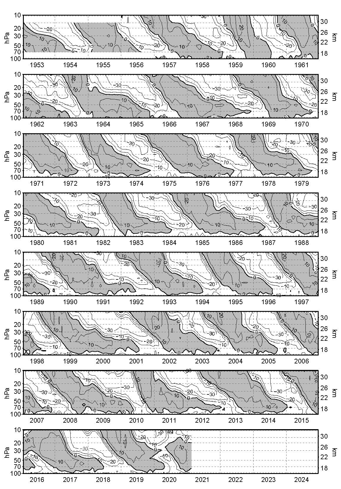

*   [Introduction](#introduction)
*   [Questions](#research-question-ideas)
*   [Data](#data)
*   [References](#references)

# Introduction
- QBO

[(@FUB)](https://www.geo.fu-berlin.de/met/ag/strat/produkte/qbo/qbo_wind_pdf.pdf)

# Research questions
- Do CMIP6 models resolve the QBO; what is the QBO period; QBO impacts? 
- Are there any hickups in the modelled QBO?
- How is the QBO generated?
- Do increasing GHGs impact the QBO? 

# Data
- CMIP6 model data, historical period (1850-2014 CE)
- Observations: FUB QBO record (Naujokat et al 1986 and updates; FUB QBO webside) 

# References
- Naujokat et al 1986
- Baldwin et al 2001 QBO Geophys Review Paper
- hick-ups: Newman et al., 2016; Osprey et al., 2016; Anstey et al, 2020.


