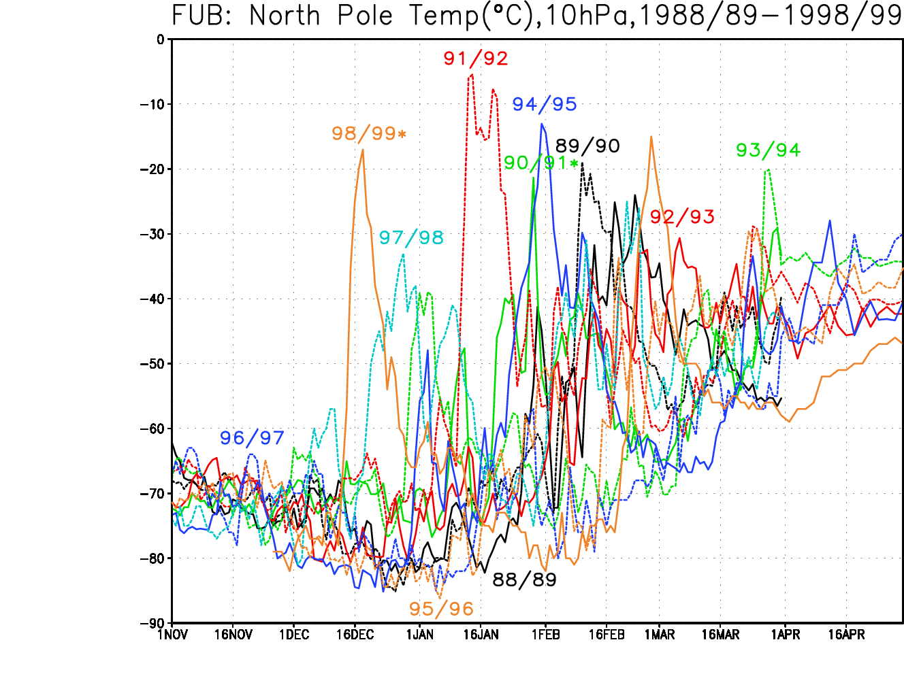

*   [Introduction](#introduction)
*   [Questions](#research-question-ideas)
*   [Data](#data)
*   [References](#references)

# Introduction
QBO

(Krüger, 2002: UiO lecture slides)

# Research question ideas
1. Frequency and timing of NH major SSWs: modelled versus observed
2. Major SSWs in the SH in present and future?
3. Impact of major SSWs on the surface climate?

# Data
NorESM2 daily [ta, ua, zg], FUB dataset 

# References
- Charlton, Andrew J., and Lorenzo Polvani "A new look at stratospheric sudden warmings. Part I: Climatology and Modeling Benchmarks." Journal of climate 20.3 (2007): 449–469.
- Charlton, Andrew J., et al. "A new look at stratospheric sudden warmings. Part II: Evaluation of numerical model simulations." Journal of climate 20.3 (2007): 470-488.
- WMO criteria (see lecture slides)


