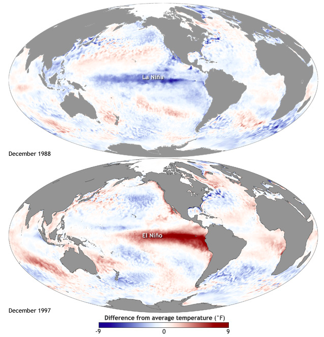
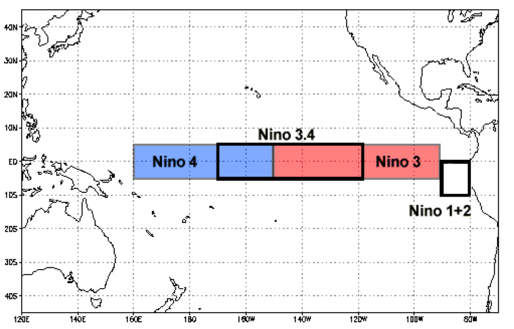
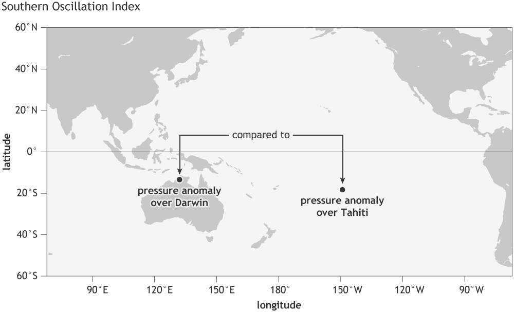
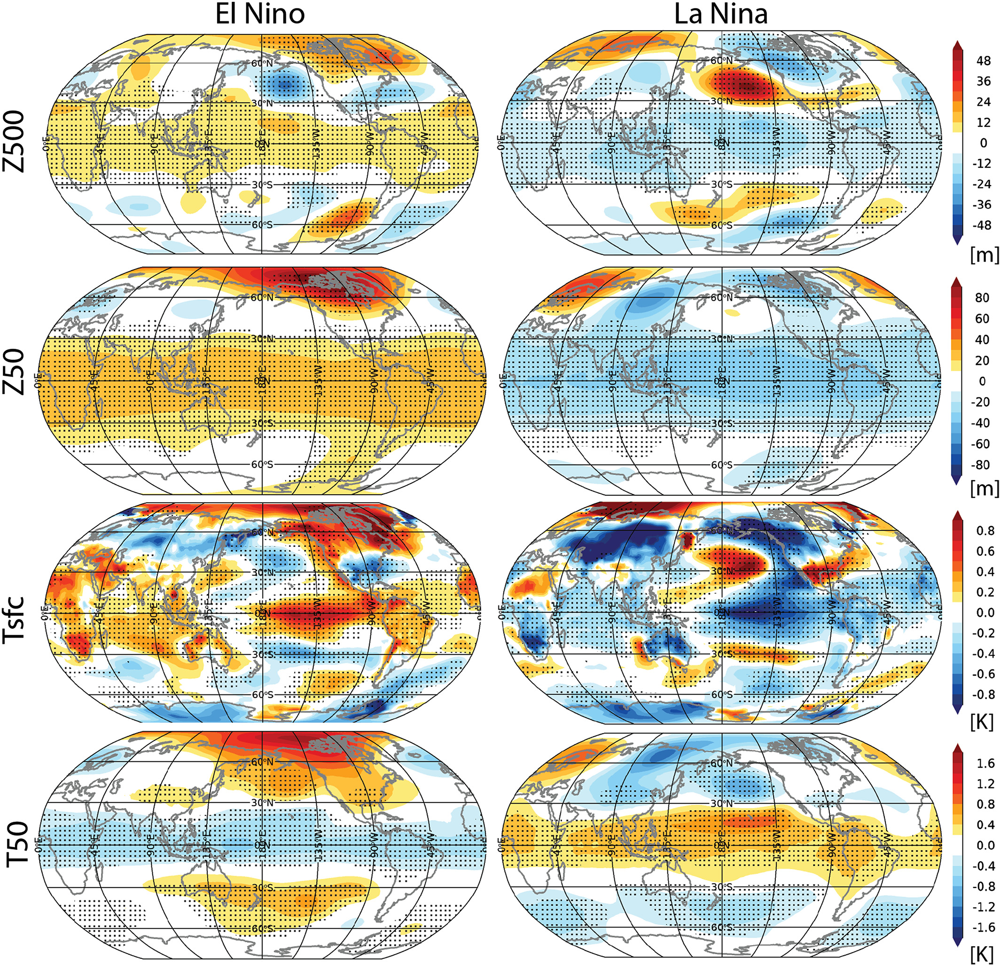

<!--
---
title: "Model topic: ENSO teleconnections"
teaching: 0
exercises: 0
questions:
- "How to analyze ENSO and its teleconnections using CMIP6 data?"
objectives:
- "Learn about ENSO and its teleconnections"
- "Learn to analyze CMIP6 data"
keypoints:
- "ENSO"
- "ENSO teleconnections"
- "ONI"
- "SOI"
---

*   [Introduction](#introduction)
*   [Questions](#research-question-ideas)
*   [Data](#data)
*   [Analysis](#analysis)
	* [El Niño regions](#el-Niño-regions)
	* [ENSO indices](#enso-indices)
*   [References](#references)

# Introduction

- As one of the pronounced internal variability in the tropics, the [**El Niño-Southern Oscillation (ENSO)**](https://en.wikipedia.org/wiki/El_Ni%C3%B1o%E2%80%93Southern_Oscillation), can lead to pronounced changes in the atmospheric circulation and to surface climate on global scale.  
- El Niño–Southern Oscillation (ENSO) refers to an atmosphere-ocean phenomena ocurring over the tropical eastern Pacific Ocean in boreal winter with an irregular variation on a time scale of 2–7 years. 
- The **Southern Oscillation (SO)** refers the accompanying atmospheric part. 
- The ENSO warming phase of the sea temperature is known as El Niño (or ENSO positive phase) and the cooling phase as La Niña (or ENSO negative phase). 
- ENSO is an atmosphere-ocean coupled system, maintained by the Bjerknes feedback.
- Understanding how well state-of-the-art climate models capture the observed characteristics of ENSO and how it will change in the future are important for model evaluation and climate prediction.

*   
Maps of sea surface temperature (SST) anomaly in the Pacific Ocean during a strong **La Niña** (top, December 1988) and **El Niño** (bottom, December 1997). Maps by [NOAA Climate.gov](https://www.climate.gov/news-features/understanding-climate/climate-variability-oceanic-ni%C3%B1o-index)

# Research question ideas

- What teleconnections do ENSO have on tropophere and stratosphere?
- Can CMIP6 model simulations capture ENSO atmospheric teleconnection?
- How will the teleconnections change in the future under different scenarios? 

<!--  
- Do CMIP6 models capture the observed ENSO characteristics?
- How will ENSO change under global warming in CMIP6 simulations?
-->

# Data

- CMIP6 model data: CESM2, CESM2-WACCM, MPI-ESM, NorESM, UKESM etc.
- CMIP6 experiments: historical, SSP585, piControl, abrupt-4xCO2
- Observations-based ENSO indices (NOAA NCEP CPC)

# Analysis

## El Niño regions

*   (@ [NOAA](https://www.ncdc.noaa.gov/teleconnections/enso/indicators/sst/#:~:text=El%20Ni%C3%B1o%20(La%20Ni%C3%B1a)%20is,C%20(%2D0.5%C2%B0C)))

There are several indices used to monitor the tropical Pacific, all of which are based on SST anomalies averaged across a given region as shown in the above figure. Usually the anomalies are computed relative to a base climatological period of 30 years. 

* [Nino regions and observed sea surface temperatures: 1950 ~ present](https://www.ncdc.noaa.gov/teleconnections/enso/indicators/sst/#:~:text=El%20Ni%C3%B1o%20(La%20Ni%C3%B1a)%20is,C%20(%2D0.5%C2%B0C))
* [Sea surface temperature and sea level pressure spatial figures in Climate Diagnostics Bulletin: 1999 ~ present](https://www.cpc.ncep.noaa.gov/products/CDB/CDB_Archive_html/CDB_archive.shtml)

## ENSO indices

The **Oceanic Niño Index (ONI)** is NOAA's primary indicator for monitoring El Niño and La Niña.
The ONI tracks the running 3-month average sea surface temperature (SST) in the east-central tropical Pacific between 120°-170°W. Scientists call the area the Niño 3.4 region. A full-fledged El Niño or La Niña is indicated when the ONI exceed +0.5C or -0.5C for at least five consecutive months.  

* [El Niño SST indices](https://climatedataguide.ucar.edu/climate-data/nino-sst-indices-nino-12-3-34-4-oni-and-tni)
* [ONI figure](https://www.climate.gov/news-features/understanding-climate/climate-variability-oceanic-nino-index)
* [ONI values](https://origin.cpc.ncep.noaa.gov/products/analysis_monitoring/ensostuff/ONI_v5.php)

The **Southern Oscillation Index (SOI)** is a standardized index based on the observed sea level pressure differences between Tahiti and Darwin, Australia.
*   (@ [NOAA climate.gov](https://www.climate.gov/news-features/blogs/enso/why-are-there-so-many-enso-indexes-instead-just-one))

* [SOI index](https://www.ncdc.noaa.gov/teleconnections/enso/indicators/soi/)
* [Climate Variability: SOI](https://www.climate.gov/news-features/understanding-climate/climate-variability-southern-oscillation-index#:~:text=The%20Southern%20Oscillation%20Index%20or,level%20pressure%20at%20each%20station)

## ENSO teleconnections

- El Niño and La Niña events have significant and disrupting impacts on the global atmospheric and oceanic circulation through atmospheric teleconnections, changing precipitation and temperature in various parts of the globe, and affecting extreme weather events worldwide. 
- El Niño Southern Oscillation (ENSO) impacts also extend above the troposphere, affecting the strength and variability of the stratospheric polar vortex in the high latitudesof both hemispheres, as well as the composition and circulation of the tropical stratosphere. 
*  
January-February-March composites of the El Niño (left) and La Niña (right) winters listed in Table 1 for geopotential height anomalies (shading, m) at 500 and 50 mb (top two rows) and temperature anomalies (shading, K) at the surface and at 50 mb (bottom two rows). The stippling indicates regions that are significantly different from the 1980–2010 climatology at the 95% level using a two-sided t test of the difference of means between El Niño and La Niña. Data is from JRA-55 reanalysis (Kobayashi et al., 2015), 1958–2016, and has been linearly detrended. (@[Domeisen et al., 2018](https://agupubs.onlinelibrary.wiley.com/doi/full/10.1029/2018RG000596))

# References

* [Domeisen et al., 2018](https://agupubs.onlinelibrary.wiley.com/doi/full/10.1029/2018RG000596)
* [Yeh et al., 2018](https://agupubs.onlinelibrary.wiley.com/doi/full/10.1002/2017RG000568)

<!--  
* See lecture slides and matrial
* [Meteorological Aspects of the ENSO: Rasmusson and Wallace, 1983](https://science.sciencemag.org/content/sci/222/4629/1195.full.pdf?casa_token=T0DAzCum0FAAAAAA:QNR4LBUu2wAbL5Ow1cKgJB8LDkhS2L0rau90TwSbI-7jUZ3Q6rhGYd5fh8w8BR9fLOd-m29dCu9rcA)
* [WMO document on ENSO](https://library.wmo.int/doc_num.php?explnum_id=7888)
* [Increase in extreme ENSOs: Cai et al 2014](https://www.nature.com/articles/nclimate2100)
* [Comparison of past and future ENSO simulations: Brown et al., 2020](https://cp.copernicus.org/articles/16/1777/2020/cp-16-1777-2020.pdf)
* [ENSO change under global warming: Fredriksen et al., 2020](https://agupubs.onlinelibrary.wiley.com/doi/full/10.1029/2020GL090640)
(El Niño and La Niña events, ENSO SST and SLV patterns)
-->
 


-->
