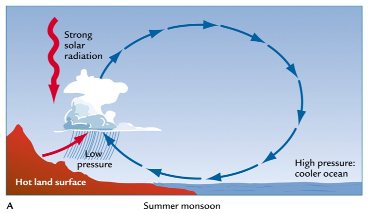
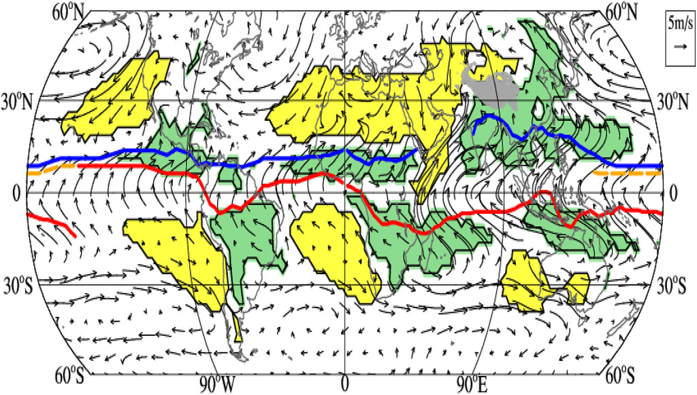
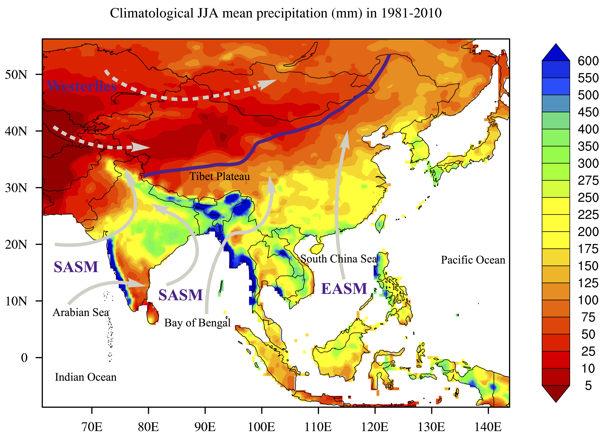

*   [Introduction](#introduction)
*   [Questions](#research-question-ideas)
*   [Data](#data)
*   [References](#references)

# Introduction
  ## Monsoon
- What is the monsoon?
  The monsoon indicates a seasonal reversing wind accompanied by corresponding changes in precipitation, but is now used to describe seasonal changes in atmospheric circulation and precipitation associated with the asymmetric heating of land and sea.
- 
Fig. Summer monsoon
- 
Fig. The GM precipitation domain (green) defined by the local summer minus winter precipitation rate exceeding 2 mm day−1, and the local summer precipitation exceeding 55% of the annual total (Wang and Ding 2008). Summer denotes May–September for the NH and November–March for the SH. The dry regions (yellow) are defined by local summer precipita-tion being less than 1 mm day−1. The arrows show August minus February 925-hPa winds. The blue (red) lines indicate the ITCZ position in August (February).(@[Wang et al., 2021](https://journals.ametsoc.org/view/journals/bams/102/1/BAMS-D-19-0335.1.xml?tab_body=fulltext-display)) 
- How to calculate monsoon indices: 
[NOAA CPC monsoon indices definitions](https://www.cpc.ncep.noaa.gov/products/Global_Monsoons/Asian_Monsoons/Figures/Index/)
[Realtime monsoon index in 2014-2015](https://www.cpc.ncep.noaa.gov/products/Global_Monsoons/Asian_Monsoons/monsoon_index.shtml)

  ## Asian Monsoon
- Asian monsoon 
* The Asian monsoon region (AMR, 8.75°S–56.25°N, 61.25°CE–143.75°E, [Cook et al., 2010](https://www.science.org/doi/10.1126/science.1185188)) is the most densely-populated region all over the world. As part of the largest continental landmass, the climate here shows large regional differences, with westerlies-dominated arid areas in the northwest part, while humid areas dominated by two monsoon subsystems – the East Asian summer
monsoon (EASM) and the South Asian summer monsoon (SASM) in the southeast part.
- 
Fig. Hydrological distribution and climate systems in the Asian monsoon region. The colors indicate the climatological June-July-August mean precipitation (mm/month) in 1981-2010, which are based on the monthly global land-surface precipitation of Global Precipitation Climatology Centre Full Data Reanalysis version 7. The purple line indicates the modern Asian summer monsoon limit. (@[Zhuo et al., 2021](https://cp.copernicus.org/preprints/cp-2021-182/))

# Research question ideas
- Is the Asian monsoon circulation weakened under global warming in CMIP6 simulation? 
- How will the Asian monsoon circulation and precipitation change in the future?
- How will the Asian monsoon circulation and precipitation change under a 4xCO2 scenario? 

# Data
- CMIP6 model data: CESM2, CESM2-WACCM, MPI-ESM, NorESM, UKESM etc.
- CMIP6 experiments: historical, SSP585, piControl, abrupt-4xCO2

# References
- [IPCC AR6 Technical Summary](https://www.ipcc.ch/report/ar6/wg1/downloads/report/IPCC_AR6_WGI_TS.pdf)
- [Wang et al., 2021](https://journals.ametsoc.org/view/journals/bams/102/1/BAMS-D-19-0335.1.xml?tab_body=fulltext-display)
- [Webster and Yang, 1992](https://www.researchgate.net/publication/227706292_Monsoon_and_ENSO_Selectively_Interactive_Systems)
- [Wang and Fan, 1999](https://journals.ametsoc.org/view/journals/bams/80/4/1520-0477_1999_080_0629_cosasm_2_0_co_2.xml)


